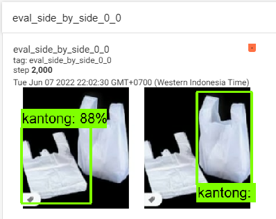
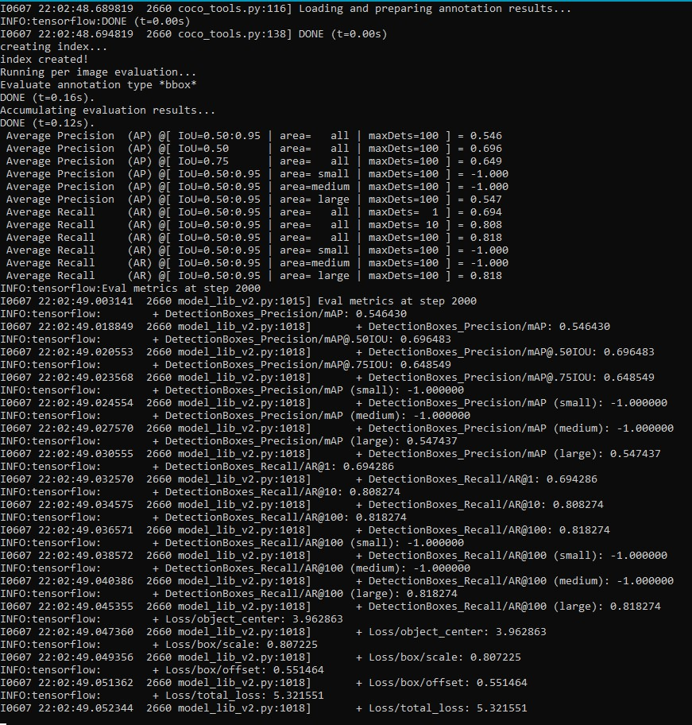

# DaurNusantara
> Object detection using Tensorflow

## Table of contents
* [General info](#general-info)
* [Screenshots](#screenshots)
* [Libraries](#libraries)
* [Setup](#setup)
* [Train and Evaluate](#train-and-evaluate)
* [Object Detection Labels](#object-detection-labels)
* [Status](#status)
* [Inspiration](#inspiration)
* [Contact](#contact)

## General info
Object detection using Tensorflow with pre-trained model Centernet. 

## Screenshots
* Training Screenshot
.png)
* Tensorboard Evaluation

* Evaluation Result


## Libraries
* Matplotlib
* Pandas
* Numpy
* Pillow
* Tensorflow - version 2.9.1
* Apache-beam
* lxml
* Cython
* Contextlib2
* Tf-slim
* Six
* Pycocotools
* lvis
* Pyparsing - version 2.4.7
* object-detection - version 0.1
* tf-object-detection-util
* protoc - version 3.19.4
* PythonAPI for cocodataset
* httplib2 - version 0.19.1
* pyparsing - version 2.4.2

## Setup
1. git clone <a href=https://github.com/tensorflow/models.git>tensorflow/models</a>
2. Download <a href=https://github.com/protocolbuffers/protobuf/releases/tag/v3.19.4>protoc 3.19.4</a> and set the PATH
3. Move to `/research` directory
3. git clone <a href=https://github.com/cocodataset/cocoapi.git>cocodataset/cocoapi</a>
4. do `pip install .` on cocoapi\PythonAPI directory
```bash
# Before pip install, go to cocoapi\PythonAPI\setup.py and change line 14 from:
extra_compile_args=['-Wno-cpp', '-Wno-unused-function', '-std=c99'],
# to
extra_compile_args={'gcc': ['/Qstd=c99']},
```
5. `protoc object_detection/protos/*.proto --python_out=.`
6. `cp tensorflow\research\object_detection\packages\tf2\setup.py`
7. `python -m pip install --upgrade pip`
8. `pip install .`
9. Test the installation with `python object_detection/builders/model_builder_tf2_test.py` (inside models\research)

## Train and Evaluate
1. Annotate image using <a href=https://makesense.ai>Makesense</a>
2. Run script.py to create CSV files
3. Run split.py to split CSV files into train and test CSV files
4. Run `python generate_tfrecord.py --csv_input='[CSV FILE]' --output_path='[OUPUT FILE RECORD]'` to generate train and test TFRecord
5. Download pre-trained model from <a href=https://github.com/tensorflow/models/blob/master/research/object_detection/g3doc/tf2_detection_zoo.md>Tensorflow 2 model zoo</a> 
6. Change .pbtxt file according to your category images label
7. Run `python transfer_learning.py`
8. (Train model) Run `python model_main_tf2.py` from tensorflow model 
```bash
"Tensorflow\models\research\object_detection\model_main_tf2.py" --model_dir="./models" --pipeline_config_path="./pretrained_model/pipeline.config" --num_train_steps=2000
```
9. (Evaluate model) Run `python model_main_tf2.py` from tensorflow model 
```bash
"Tensorflow\models\research\object_detection\model_main_tf2.py" --model_dir="./models" --pipeline_config_path="./pretrained_model/pipeline.config" --checkpoint_dir="./models"
```
10. Run `Tensorboard --logdir=.` on both ./models/train and ./models/eval directory
11. **(WIP)**

## Object Detection Labels
* kantong (ID: 0) 
* kertas (ID: 1) 
* piring (ID: 2) 
* sampah_organik (ID: 3)
* kardus (ID: 4) 
* cup (ID: 5) 
* kaleng (ID: 6)
* botol (ID: 7)

## Status
Project is: _in progress_

## Inspiration
Project inspired by Google Bangkit Product Capstone Project.

## Contact
> If you have a question, please write `Object Detection` as email's subject
* Benidictus Galih Mahar Putra - benidictusgalih@gmail.com
* Leo Cardhio Sih Pratama - leocardhio@gmail.com
* Victor Sean Lambert - vlotusan@gmail.com
